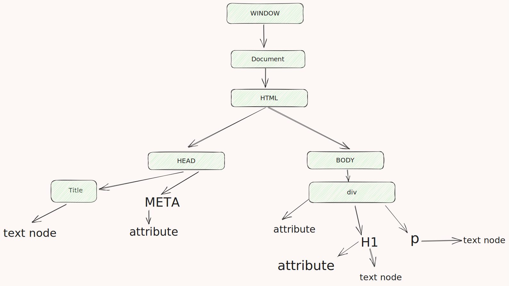
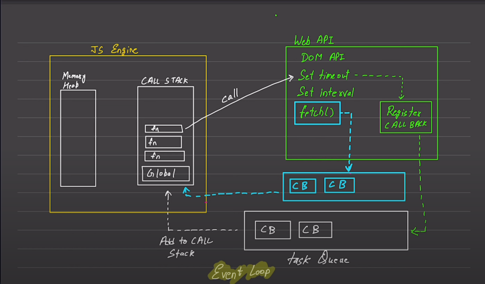
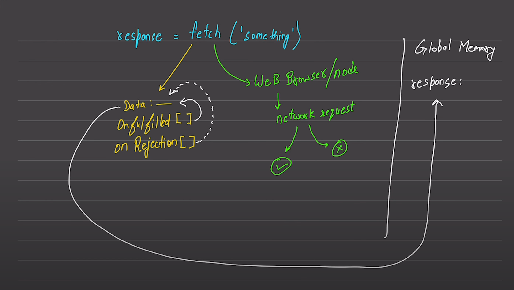

# js-practice

# HTML DOM break down

```HTML
<!DOCTYPE html>
<html lang="en">
<head>
    <meta charset="UTF-8">
    <title>Document</title>
    <style>
        .bg-black{
            background-color: #212121;
            color: #fff;
        }
    </style>
</head>
<body class="bg-black">
    <div>
        <h1 id="title" >DOM learning on Chai aur code </h1>
        <p> this is a test paragraph</p>
    </div>
</body>
</html>
```



# JS engine and event loop



# JS fetch api flow



## [Notes](./10_classes_and_opp/readme.md)
